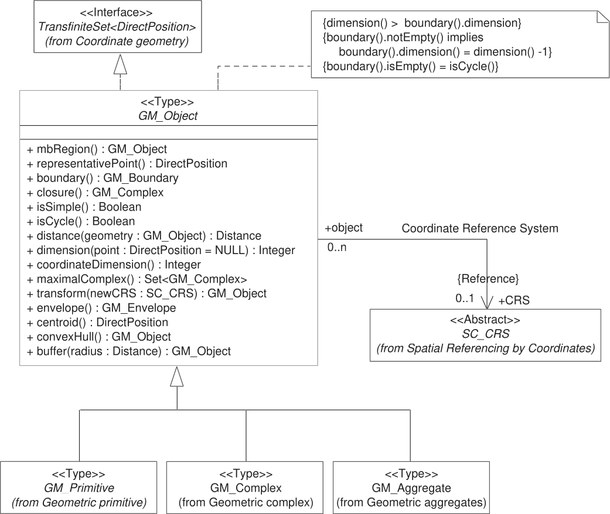
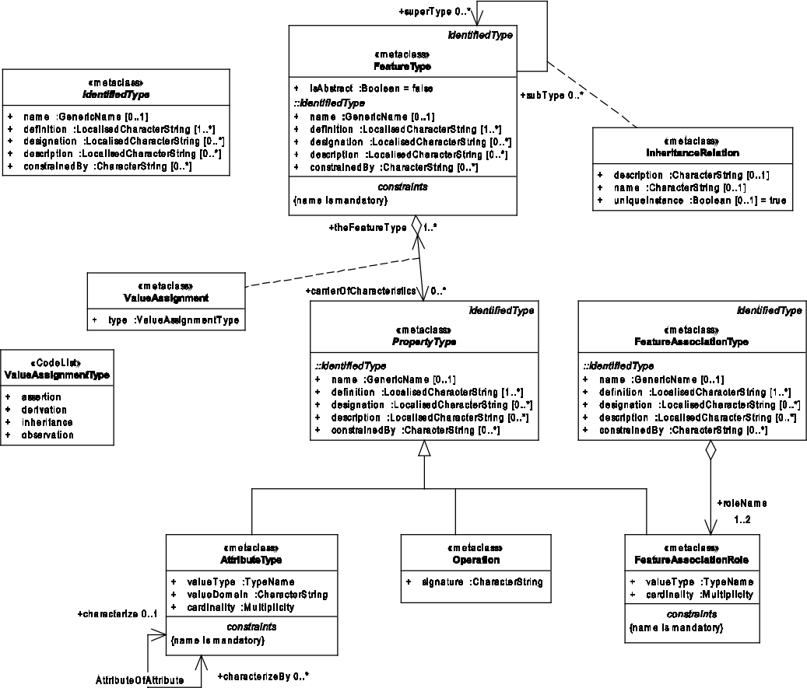
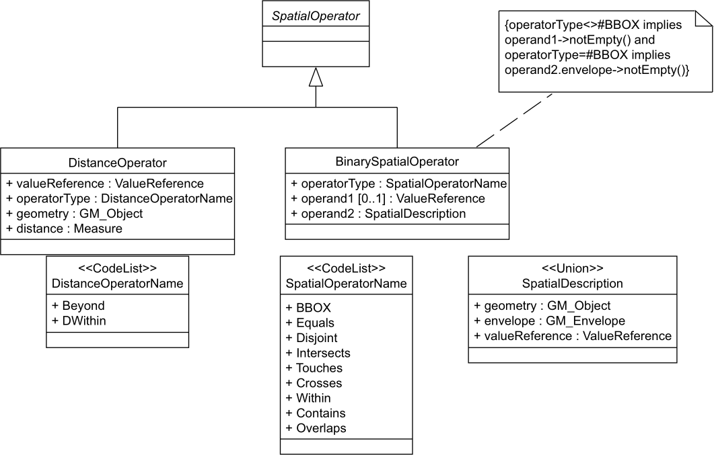
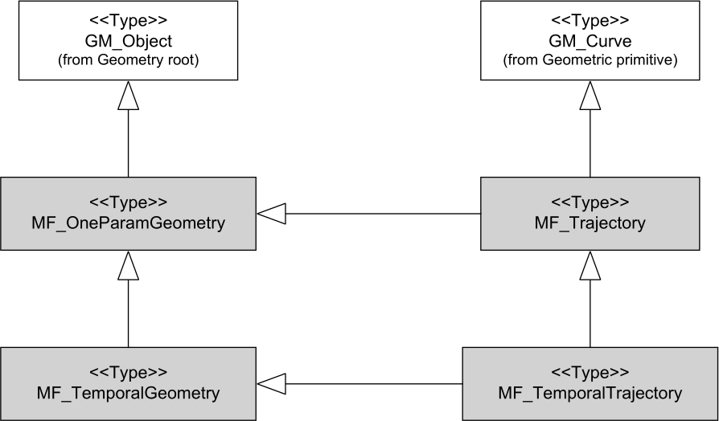
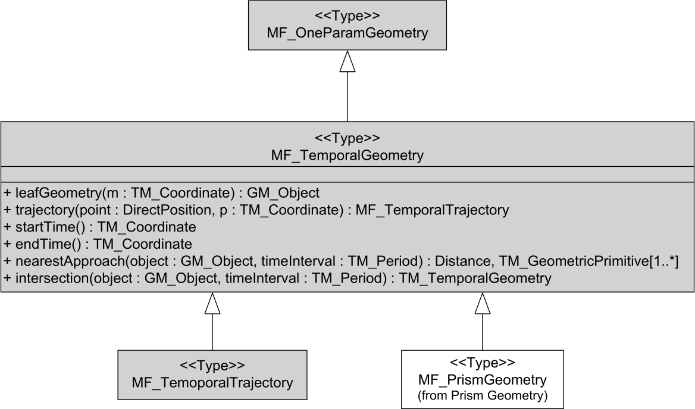
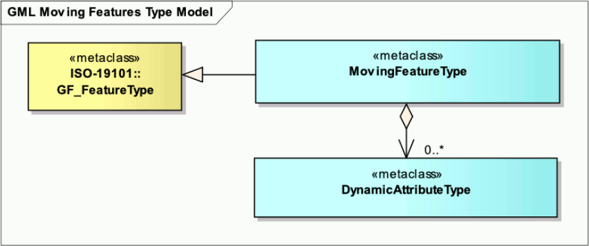

[appendix]
:appendix-caption: Annex
== Relationship with other OGC/ISO standards (Informative)

This specification is built upon the following OGC/ISO standards.
The geometry concept is presented first, followed by the feature concept.
Note that a feature is _not_ a geometry.
Instead, a feature may _contain_ a geometry as one of its attributes.
But a feature can also contain non-geometric attributes such as a name, a color or a temperature.
It is legal to build features without geometry attribute, or with more than one geometry attributes.

=== Static geometries and simple features

The standards listed in this section define static objects, without time-varying properties.
Those standards will be extended in the next section (_Temporal geometries and moving Features_)
with time-varying properties.

==== Geometry (ISO 19107)

The ISO 19107, _Geographic information — Spatial schema_ standard
defines a `GM_Object` base type which is the root of all geometric objects.
Some examples of `GM_Object` subtypes are `GM_Point`, `GM_Curve`, `GM_Surface` and `GM_Solid`.
Each instance of those types can be regarded as an infinite set of points in a particular coordinate reference system.
In practice, only a finite set of points is stored in a geometry and other points are interpolated.
The standard provides a `GM_CurveInterpolation` code list to identify how those points are computed from a finite set of points.
Some interpolation methods listed by ISO 19107 are (non-exhaustive list):

linear::
Positions on a straight line between each consecutive pair of control points.

geodesic::
Positions on a geodesic curve between each consecutive pair of control points.
A geodesic curve is a curve of shortest length.
The geodesic shall be determined in the coordinate reference system of the curve.

circularArc3Points::
For each set of three consecutive control points,
a circular arc passing from the first point through the middle point to the third point.
Note: if the three points are co-linear, the circular arc becomes a straight line.

elliptical::
For each set of four consecutive control points,
an elliptical arc passing from the first point through the middle points in order to the fourth point.
Note: if the four points are co-linear, the arc becomes a straight line.
If the four points are on the same circle, the arc becomes a circular one.

cubicSpline::
The control points are interpolated using initial tangents and cubic polynomials, a form of degree 3 polynomial spline.

The UML below shows the `GM_Object` base type with its operations,
for example `distance(…)` for computing the distance between two geometries.
All those operations assume static objects, without time-varying coordinates or attributes.
For example the `distance(…)` operator does not take in account whether the two objects were
_at the same time_ at the location where shortest distance is found.

.GM_Object from ISO 19107:2003 figure 6

**TODO:** above discussion is based on ISO 19107:2003. It needs to be updated for latest revisions.

**TODO:** provide a simplified version of this UML.
`GM_Curve` (a subtype of `GM_Primitive`) is not shown in above UML. It should be show in a new UML.

Geometry, topology and temporal-objects (`GM_Object`, `TP_Object`, `TM_Object`) are not features.
These types can provide types for feature _properties_, but cannot be specialized to feature types.
Feature types and properties are described in the next section.

==== Features (ISO 19109)

==== Features (ISO 19109)

The ISO 19109, _Geographic information — Rules for application schema_ standard
defines types for the definition of features.
A feature is an abstraction of a real-world phenomena.
The terms “feature type” and “feature instance” are used to separate the following concepts of “feature”:

Feature type::
The whole collection of real-world phenomena classified in a concept.
For example the “bridge” feature type is the abstraction of the collection of all real-world phenomena
that is classified into the concept behind the term “bridge”.

Feature instance::
A certain occurrence of a feature type.
For example “Tower Bridge” feature instance is the abstraction of a certain real-world bridge in London.

[NOTE]
======
In object-oriented modeling, feature types are equivalent to classes and feature instances are equivalent to objects.
The feature properties (presented below) are equivalent to fields.
======

Feature type instance::
The UML shown below contains a subtlety explained here but ignored for simplicity in the rest of this document:
`FeatureType` is defined as a metaclass, i.e. a class for describing other classes.
A _feature type instance_ (not to be confused with a _feature instance_) is a class that represent an individual feature type.
For example “bridge” and “park” are two instances of `FeatureType`.
Then “Tower Bridge” and “Golden Gate Bridge” are two `Feature` instances of the “bridge” `FeatureType` instance,
and “Jardin des Tuileries” is a `Feature` instance of the “park” `FeatureType` instance.

[NOTE]
======
The assertion that `FeatureType` is a metaclass means that in statically typed languages such as Java or C{plus}{plus},
a `FeatureType` instance can generally not be represented directly as a Java or C{plus}{plus} class
(unless the class properties are known at compile-time).
Developers in those languages have to use more indirect mechanisms such as reflections or dictionaries (hash maps).
Dynamic languages such as Python can use feature type instances more directly,
but at the cost of type safety in the general case.
======

The UML below shows the ISO 19109 General Feature Model.
A `FeatureType` contains the list of properties (attributes, associations and operations)
that `Feature` instances of that type can contain.
In other words, a feature can be seen as a collection of property values.
Geometries are feature properties (more precisely attributes) like any other, without any special treatment.
All properties are static, without time-varying values.

.General Feature Model from ISO 19109:2009 figure 5

**TODO:** provide a simplified version of this UML.

==== Simple Features SQL (OGC 06-104)

The link:https://portal.ogc.org/files/?artifact_id=25354[Simple Feature Access — Part 2: SQL Option] standard
describes a feature access implementation in SQL based on a profile of ISO 19107.
This standard defines _feature table_ as a table where the columns represent feature attributes,
and the rows represent feature instances.
The geometry of a feature is an ordinary feature attribute, i.e. a single column in the table.
In spatial databases, the geometry columns have a geometry type such as `ST_Point` or `ST_Polygon`;
in databases without spatial support, an alternative approach described by the standard can be used.

This data organization implies that feature instances received by a server in JSON format (for example)
should not be stored verbatim, but instead should be deconstructed in their properties.
Then each attribute value is stored in a column of the table that corresponds to the feature type,
and associations to other features are stored as foreigner keys.
An inconvenient of this approach is that the set of feature types and their properties
may need to be known in advance in order to define the database schema.
But two advantages of this approach are that
1) efficient SQL queries can be used as described in the next section, and
2) the feature instances can be reconstructed and exported in various formats such as JSON, XML, CSV or netCDF.

==== Filter Encoding (ISO 19143)

The ISO 19143, _Geographic information — Filter encoding_ standard
(also link:https://portal.ogc.org/files/?artifact_id=39968[OGC standard]) provides types for constructing queries.
These objects can be transformed into a SQL “SELECT … FROM … WHERE … ORDER BY …” statement to fetch data stored in a SQL-based relational database.
Similarly, the same objects can be transformed into an XQuery expression in order to retrieve data from XML document.
The UML below shows the objects used for querying a subset based on spatial operations such as “contains” or “intersects”.

.Spatial operators from ISO 19143 figure 6

The same specification defines also how to encode above objects in XML or CQL formats.
The abstract model shown by above UML helps developers to identify which concepts are common to all formats,
which makes easier to implement conversions to SQL or XPath.

All filters defined in ISO 19143 are static; there is no operator taking movement in account.
New operators for moving features can be defined using ISO 19141 (see below) as a definition source.

==== Features web API (OGC 17-069)

The link:http://docs.opengeospatial.org/is/17-069r3/17-069r3.html[OGC 17-069, _Features — Part 1: Core_] standard
specifies the fundamental building blocks for interacting with features using Web API.
This base standards allow to get all features available on a server,
or to get feature instances by their identifier.

==== Features Filtering web API

The link:https://portal.ogc.org/files/96288[OGC TBD, _Features — Part 3: Filtering and the Common Query Language (CQL)_] standard
extends the Feature web API with capabilities to encode more sophisticated queries.
The conceptual model is close to ISO 19143.

=== Temporal geometries and moving Features

==== Moving Features (ISO 19141)

The ISO 19141, _Geographic information — Schema for moving features_ standard
extends the ISO 19107 spatial schema for addressing features whose locations change over time.
Despite the “Moving Features” name, that standard is more about “Moving geometries”.
The UML below shows how the `MF_Trajectory` type extends the “static” types from ISO 19107.

.Trajectory type from ISO 19141 figure 3

Trajectory inherits some operations shown below.
Those operations are in addition to the operations inherited from `GM_Object`.
For example the `distance(…)` operation from ISO 19107 is now completed by a time-aware `nearestApproach(…)` operation.

.Temporal geometry from ISO 19141 figure 6

The operations defined by above UML can be used as a source of definitions
for new filter operations in complement to the static operations defined by ISO 19141.

==== Moving Features XML encoding (OGC 18-075)

The link:http://docs.opengeospatial.org/is/18-075/18-075.html[OGC 18-075 _Moving Features Encoding Part I: XML Core_]
standard takes a subset of ISO 19141 specification and encodes it in XML format.
But that standard also completes ISO 19141 by allowing to specify attributes whose value change over time.
This extension to above _General Feature Model_ is shown below:

.Dynamic attribute from OGC 18-075 figure 3

==== Moving Features JSON encoding (OGC 19-045)

The link:http://docs.opengeospatial.org/is/19-045r3/19-045r3.html[OGC 19-045 _Moving Features Encoding Extension — JSON_]
standard takes a subset of ISO 19141 specification and encodes it in JSON format.
The specification provides various UML diagrams summarizing ISO 19141.

==== Moving Feature Access (OGC 16-120)

The link:http://docs.opengeospatial.org/is/16-120r3/16-120r3.html[OGC 16-120, _Moving Features Access_] standard
(TODO)

